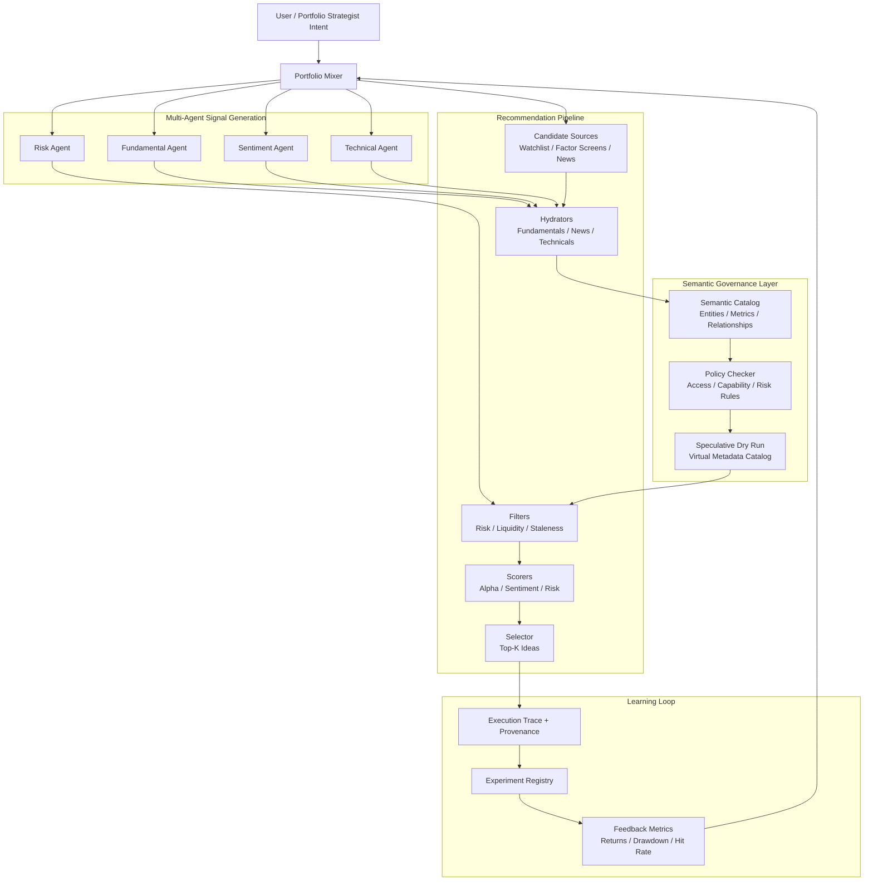

# AIfund Architecture Diagram

AIfund is framed as a governed recommendation and analytics platform for autonomous financial intelligence agents.

The key design boundary is:

```text
agent intent -> governed execution plan
```

rather than direct tool invocation.

## System overview



## Component mapping

| Component | Role in AIfund | DS Platform Analogy |
|---|---|---|
| Portfolio Mixer | Orchestrates candidate retrieval, agent signals, filtering, scoring, and selection | Serving/control plane |
| Candidate Sources | Produces possible securities or portfolio ideas | Candidate generation / retrieval |
| Hydrators | Enrich candidates with fundamentals, news, technicals, and market context | Feature enrichment |
| Multi-Agent Signal Generation | Converts domain reasoning into structured signals | Semantic feature generation |
| Semantic Catalog | Defines entities, metrics, relationships, and allowed access patterns | Semantic layer / data catalog |
| Policy Checker | Validates plan-level access, capability, and risk constraints | Governance / policy engine |
| Speculative Dry Run | Simulates execution before touching production tools or data | Safe execution planning |
| Scorers + Selector | Ranks and selects portfolio ideas | Ranking / recommendation layer |
| Execution Trace | Explains what happened and why | Lineage / provenance |
| Experiment Registry | Tracks strategy versions and outcomes | Experimentation platform |

## MVP flow

```text
"Find attractive NVDA alternatives"
        |
        v
Portfolio Mixer retrieves candidate assets
        |
        v
Agents generate structured fundamental, sentiment, technical, and risk signals
        |
        v
Semantic catalog validates entities, metrics, and relationships
        |
        v
Policy checker validates allowed access and required provenance
        |
        v
Dry-run layer simulates execution against virtual metadata
        |
        v
Recommendation pipeline filters, scores, and selects top ideas
        |
        v
Output includes recommendation, score, rationale, and provenance trace
```

## Why this matters

This project is intentionally not optimized around stock-picking accuracy first. It is optimized around platform architecture:

- governed semantic access
- multi-agent signal generation
- recommendation/ranking infrastructure
- traceable analytical execution
- experimentation and feedback loops

That makes AIfund a capstone for intelligent data platform design rather than a generic AI trading bot.
